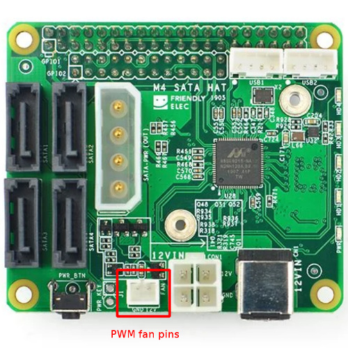
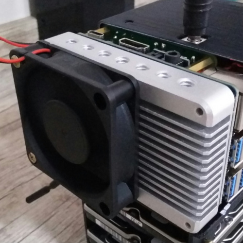
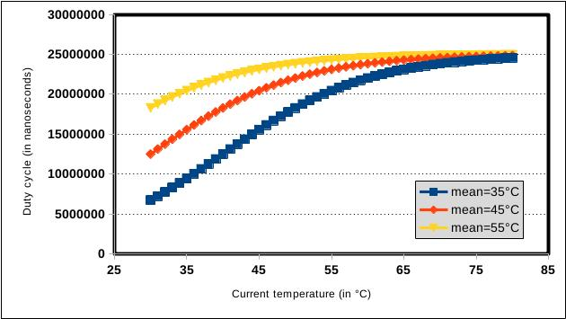
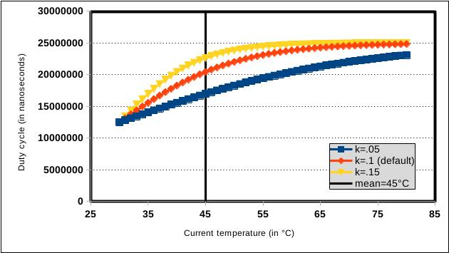
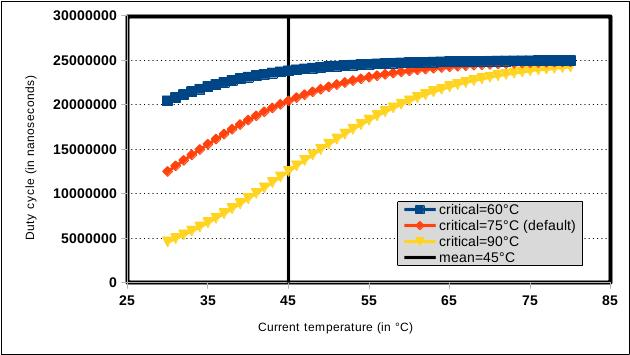

# nanopim4-satahat-fan
A fan control script written in bash for the [**2-pin PH2.0 12v fan connector of the NanoPi M4 SATA hat**](http://wiki.friendlyarm.com/wiki/index.php/NanoPi_M4_SATA_HAT). By default, the script uses a bounded [logistic model](https://en.wikipedia.org/wiki/Logistic_function) with a moving mid-point (based on the average temperature over time) to set the fan speed.

Many of the variables used in this fan controller can be modified directly from the CLI, such as setting custom temperature thresholds (`-t`, `-T`) or disabling temperature monitoring altogether (`-f`). For a more detailed description, see [**Usage**](#usage).

There's arguably more code here than necessary to run a fan controller. This was a hobby of mine (I wanted to revisit the first version which used a fixed table to set the speed) and an opportunity to learn more about bash and the sysfs interface.  There are multiple comments in the script as well, which makes it easy to edit for other similar cases.

This is free. There is NO WARRANTY. Use at your own risk.

If you have any issues or suggestions, open an issue or [send me an e-mail](mailto:me@cgomesu.com).


# Table of Contents
1. [Requisites](#requisites)
2. [Installation](#installation)
3. [Usage](#usage)
4. [Controllers](#controllers)
   - [Logistic](#logistic)
5. [Implementation](#Implementation)
   - [Systemd](#systemd)

[:arrow_up: top](#)


# Requisites
- Linux distro;
- Access to the [pwm sysfs interface](https://www.kernel.org/doc/Documentation/pwm.txt) (run with `sudo` permission or as `root`);
- [GNU bash](https://www.gnu.org/software/bash/) (recommend v5.x);
- [GNU basic calculator](https://www.gnu.org/software/bc/);
- Standard GNU/Linux commands.

Besides bash, you don't need to check for any of these requisites manually. The script will automatically check for everything it needs to run and will let you know if there's any errors or missing access to important commands.  

The controller was developed with **Armbian OS** but you should be able to run it on **any other Linux distro** for the NanoPi M4. For reference, this script was originally developed with the following hardware:
-  NanoPi-M4 v2
-  M4 SATA hat
-  12V (.08A-.2A) generic fan (**do not** try to use more than **200mA**)

And software:
-  Kernel: Linux 4.4.213-rk3399
-  OS: Armbian Buster (21.08.8) stable
-  GNU bash v5.0.3
-  bc v1.07.1

<p align="center">
  <br><br>
  
</p>

[:arrow_up: top](#)


# Installation
To install the fan controller script, run the following commands either as `root` or append `sudo` to each command with a user that has sudo permission:

1. Install `git` and `bc` (GNU Basic Calculator).
   ```
   apt update && apt install git bc
   ```
2. Create a new directory in `/opt` for the default branch (`master`) of the `nanopim4-satahat-fan` repository.
   ```
   cd /opt
   git clone https://github.com/cgomesu/nanopim4-satahat-fan.git
   cd nanopim4-satahat-fan/
   ```
3. Test the script.
   ```
   ./pwm-fan.sh -F 10
   ```
   And if you run into any error messages, fix the issue and try again. Otherwise, press `Ctrl`+`c` to send an interrupt signal and stop the script.

4. *Optional.* Check [Usage](#usage) for non-default options that you might want to test before running the script in the background.

5. *Optional.* If using thermal controllers, take a look at [Controllers](#controllers) to learn how to tune a few parameters to best fit your environment.

6. Lastly, see the [Implementation](#implementation) section for information on how to run the script in the background.

[:arrow_up: top](#)


# Usage
```
./pwm-fan.sh -h
```
```
Usage:

./pwm-fan.sh [OPTIONS]

  Options:
    -c  str  Name of the PWM CHANNEL (e.g., pwm0, pwm1). Default: pwm0
    -C  str  Name of the PWM CONTROLLER (e.g., pwmchip0, pwmchip1). Default: pwmchip1
    -d  int  Lowest DUTY CYCLE threshold (in percentage of the period). Default: 25
    -D  int  Highest DUTY CYCLE threshold (in percentage of the period). Default: 100
    -f       Fan runs at FULL SPEED all the time. If omitted (default), speed depends on temperature.
    -F  int  TIME (in seconds) to run the fan at full speed during STARTUP. Default: 60
    -h       Show this HELP message.
    -l  int  TIME (in seconds) to LOOP thermal reads. Lower means higher resolution but uses ever more resources. Default: 10
    -m  str  Name of the DEVICE to MONITOR the temperature in the thermal sysfs interface. Default: soc
    -p  int  The fan PERIOD (in nanoseconds). Default (25kHz): 25000000.
    -s  int  The MAX SIZE of the TEMPERATURE ARRAY. Interval between data points is set by -l. Default (store last 1min data): 6.
    -t  int  Lowest TEMPERATURE threshold (in Celsius). Lower temps set the fan speed to min. Default: 25
    -T  int  Highest TEMPERATURE threshold (in Celsius). Higher temps set the fan speed to max. Default: 75
    -u  int  Fan-off TEMPERATURE threshold (in Celsius). Shuts off fan under the specified temperature. Default: 0
    -U  int  Fan-on TEMPERATURE threshold (in Celsius). Turn on fan control above the specified temperature. Default: 1

  If no options are provided, the script will run with default values.
  Defaults have been tested and optimized for the following hardware:
    -  NanoPi-M4 v2
    -  M4 SATA hat
    -  Fan 12V (.08A and .2A)
  And software:
    -  Kernel: Linux 4.4.213-rk3399
    -  OS: Armbian Buster (21.08.8) stable
    -  GNU bash v5.0.3
    -  bc v1.07.1

Author: cgomesu
Repo: https://github.com/cgomesu/nanopim4-satahat-fan

This is free. There is NO WARRANTY. Use at your own risk.

```

[:arrow_up: top](#)


# Examples
- Run with a custom period and min/max temperature thresholds.
  ```
  ./pwm-fan.sh -p 25000000 -t 30 -T 60
  ```

- Run with defaults, except that the minimum duty cycle threshold is 40%.
  ```
  ./pwm-fan.sh -d 40
  ```

- Run in full speed mode all the time.
  ```
  ./pwm-fan.sh -f
  ```

- Set fan startup to 15 sec.
  ```
  ./pwm-fan.sh -F 15
  ```

- When using args `-u` and `-U` (introduced by [@araynard](https://github.com/araynard) via [#7](https://github.com/cgomesu/nanopim4-satahat-fan/pull/7)), it is recommended to leave a difference of at least 5°C between them.  In most cases, `-u` can be set to a value slightly higher than the idle temperature *with* the fan, whereas `-U` can be set to a value slightly higher than the idle temperature *without* the fan.
  ```
  ./pwm-fan.sh -u 45 -U 55
  ```

[:arrow_up: top](#)


# Controllers
## Logistic
The default thermal controller is based on a [logistic model](https://en.wikipedia.org/wiki/Logistic_function) that outputs the duty cycle in nanoseconds, owing to the constraint that *L* = upper duty cycle threshold, which can be specified via the argument `-D` in percentage of the period.

The following plot illustrates how the logistic controller changes the duty cycle as a function of the current temperature using default parameter values and three different mean temperatures:

<p align="center">
  
</p>

The parameters *k* (*k* = *a*/*b*), as well as the critical temperature (75°C) used as reference for the moving mid-point, can both be modified by editing the script.  The following plot illustrates the effects of changing *k* while holding the mean temperature constant (everything else follows default):

<p align="center">
  
</p>

Similarly, the following plot illustrates the effects of changing the critical temperature while holding the mean temperature constant (everything else follows default):

<p align="center">
  
</p>

[:arrow_up: top](#)


# Implementation
## Systemd
If you're running options different than the default ones, first edit the `systemd/pwm-fan.service` file to include those options into the `ExecStart=` command execution. Then, run the following commands to enable and start the `pwm-fan.service`:

1. Enable the service and start it.
   ```
   systemctl enable /opt/nanopim4-satahat-fan/systemd/pwm-fan.service
   # alternatively, copy the service file to '/lib/systemd/system/' and enable it via 'systemctl enable pwm-fan.service'.
   systemctl start pwm-fan.service
   ```
2. Then, check the service status to make sure it's running without issues.
   ```
   systemctl status pwm-fan.service
   ```

[:arrow_up: top](#)
